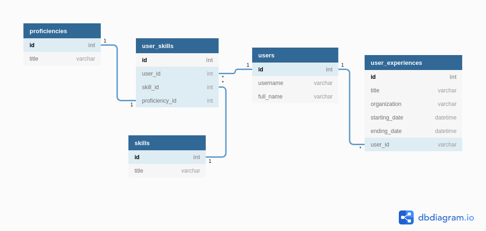

# Skill list back end

> This is an API that list the skills of any given user.

For this project I used the following schema:

## Endpoint

> api/v1/$username 

## Built With

- Ruby on rails

## Getting Started

To get a local copy up and running follow these simple example steps.

#### Prerequisites

- Ruby >= 3.0.1 
- Ruby on Rails >= 7.0.2

### Setup

- Open the terminal
- Open the directory where you want to store the project
- Clone the project runing 'git clone https://github.com/LOctavio/skills-list-back-end' on the terminal

### Install

- Open the project directory on the terminal
- Inside the project's directory run 'bundle install' to install all the dependencies
- run 'rails db:create' to create the database
- run 'rails db:migrate' to migrate the database
- run 'rails db:seed' to run the seed for adding the examples

### Usage

- Open the project directory on the terminal
- Run 'rails server' to start the server
- Open the web browser and go to 'localhost:3000' to see the web page

## Authors

👤 **Luis Octavio Ramirez Cruz**

- GitHub: [LOctavio](https://github.com/LOctavio)
- Twitter: [@Octavio_ram431](https://twitter.com/Octavio_ram431)
- LinkedIn: [Luis Octavio Ramirez Cruz](https://www.linkedin.com/in/luis-octavio-ramirez-cruz/)

## 🤝 Contributing

Contributions, issues, and feature requests are welcome!

Feel free to check the [issues page](https://github.com/LOctavio/skills-list-back-end/issues).

## Show your support

Give a ⭐️ if you like this project!

## 📝 License

This project is [MIT](./MIT.md) licensed.
